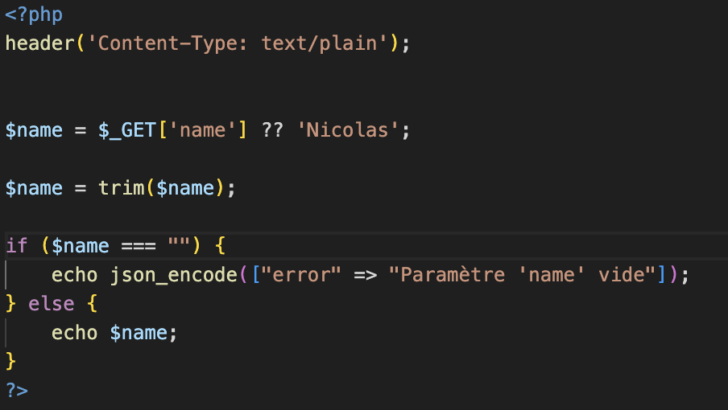
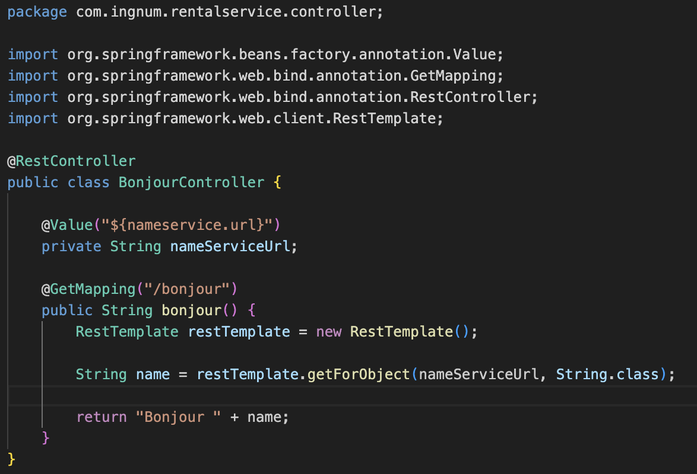
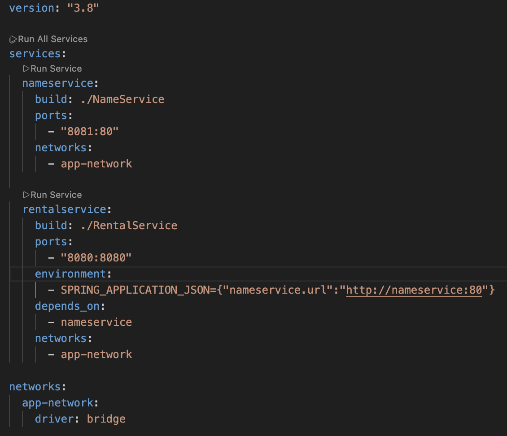
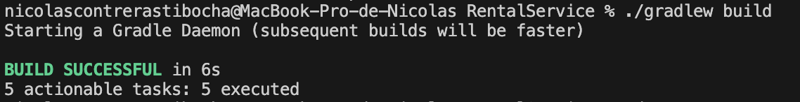
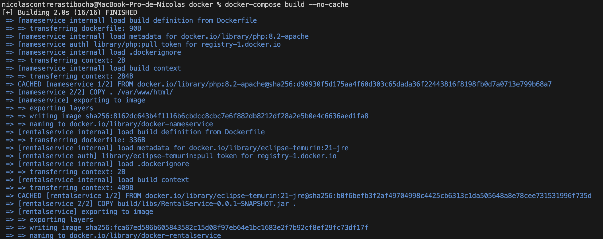
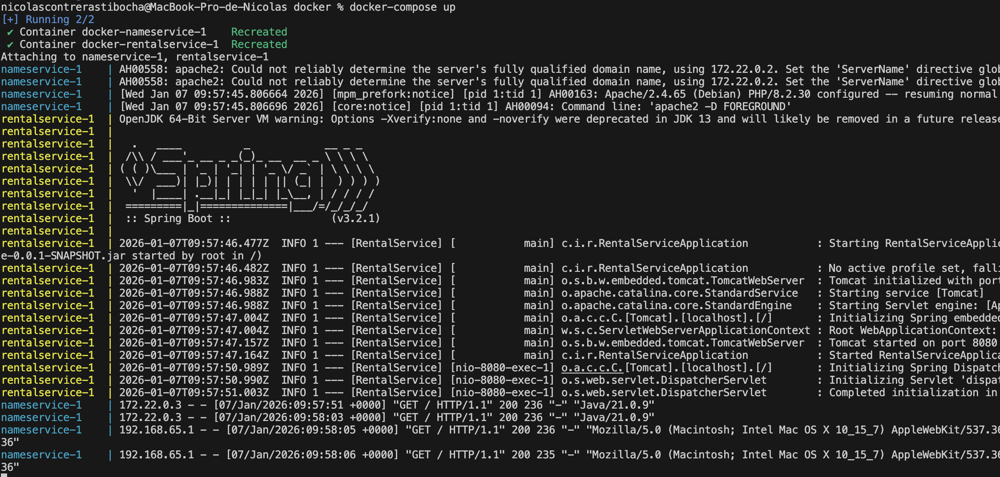
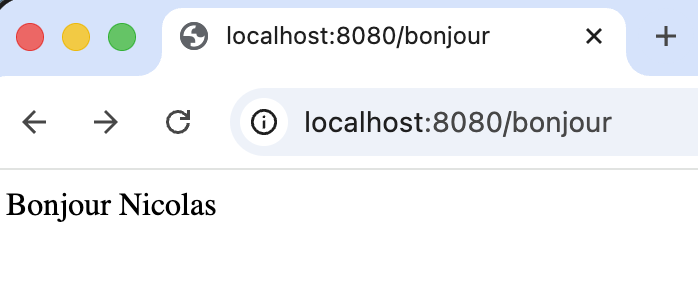

# RentalService

## Présentation du projet

**RentalService** est une application Java (Spring Boot) permettant de fournir un service backend exposé via une API REST.\
Le projet est construit avec **Gradle** et packagé sous forme de **JAR**, puis exécuté dans un **conteneur Docker**.

Ce projet illustre :

- La compilation d’un projet Java avec Gradle
- La création d’une image Docker
- Le lancement d’une application Java dans un conteneur

---

## Prérequis

### Prérequis communs (Mac & Windows)

- **Java JDK 21** (LTS)
- **Docker** (Docker Desktop recommandé)
- **Git** (optionnel)

---

## Structure du projet

```
RentalService/
├── build/
│   └── libs/
│       └── RentalService-0.0.1-SNAPSHOT.jar
├── src/
├── build.gradle
├── settings.gradle
├── gradlew
├── gradlew.bat
├── Dockerfile
└── README.md
```

---

## Compilation du projet (Gradle)

Avant de lancer Docker, le projet doit être **compilé** afin de générer le fichier JAR.

### Sur macOS / Linux

```bash
./gradlew build
```

### Sur Windows (PowerShell ou CMD)

```bat
gradlew build
```

Le JAR généré se trouve dans :

```
build/libs/RentalService-0.0.1-SNAPSHOT.jar
```

---

## Dockerisation du projet

### Contenu du Dockerfile

Le projet utilise une image Java officielle **Eclipse Temurin 21** (JRE) :

```dockerfile
FROM eclipse-temurin:21-jre

COPY build/libs/RentalService-0.0.1-SNAPSHOT.jar .

CMD ["java", "-Xmx300m", "-Xms300m", "-XX:TieredStopAtLevel=1", "-noverify", "-jar", "RentalService-0.0.1-SNAPSHOT.jar"]

EXPOSE 8080
```

---

## Création de l’image Docker

Se placer **dans le dossier RentalService**.

### Commande (Mac & Windows)

```bash
docker build -t rentalservice .
```

Vérification :

```bash
docker images | grep rentalservice
```

---

## Lancement de l’application

### Démarrage du conteneur

```bash
docker run -p 8080:8080 rentalservice
```

Ou en arrière-plan :

```bash
docker run -d -p 8080:8080 --name rentalservice-container rentalservice
```

---

## Accès à l’application

Une fois le conteneur lancé, l’application est accessible à l’adresse :

```
http://localhost:8080
```

---

## Commandes utiles Docker

Arrêter le conteneur :

```bash
docker stop rentalservice-container
```

Supprimer le conteneur :

```bash
docker rm rentalservice-container
```

Supprimer l’image :

```bash
docker rmi rentalservice
```

---

## Remarques importantes

- L’image `openjdk:21` n’est plus disponible sur Docker Hub
- `eclipse-temurin:21-jre` est la **solution recommandée**
- Java 21 est une version **LTS stable**, idéale pour Gradle et Docker

---

## Résumé rapide

1. Compiler le projet avec Gradle
2. Construire l’image Docker
3. Lancer le conteneur
4. Accéder à l’application via le navigateur

---

Projet prêt à être exécuté sur **macOS** et **Windows**

# TP2

## Ajout d'un deuxième microservice PHP



## Modifcation du fichier Java pour mettre une requête HTTP



## Création du fichier docker-compose.yml



## Build Java

```bash
./gradlew build
```



## Création et lancement de docker compose

```bash
docker-compose build
```



```bash
docker-compose up
```



## Rendu URL


